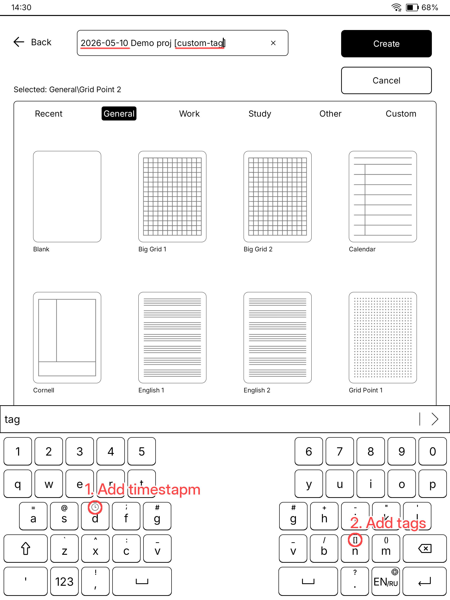
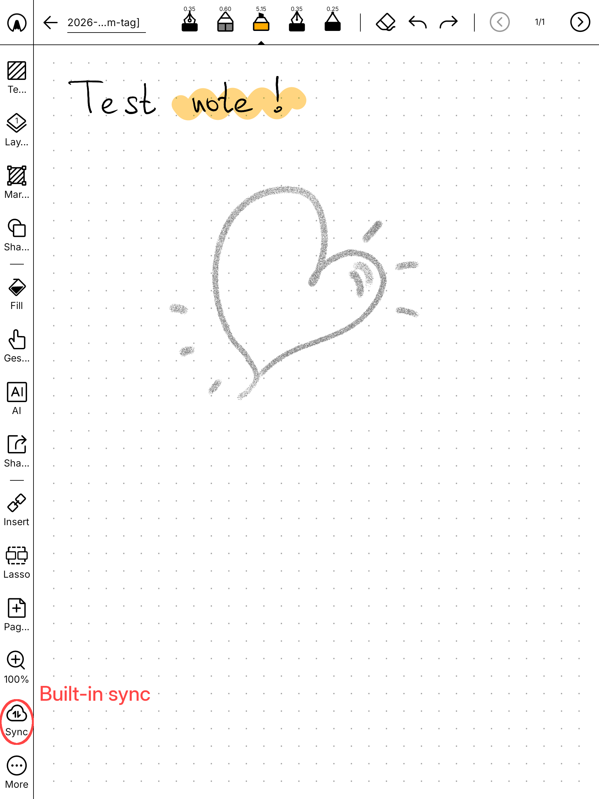
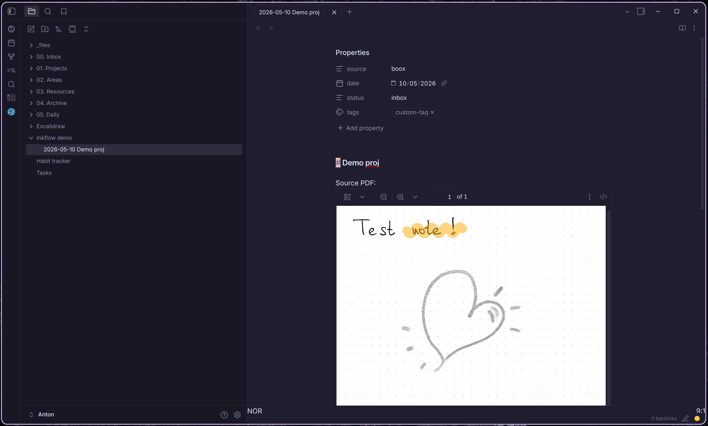

# inkflow

WebDAV bridge to Obsidian.

BOOX uploads a PDF to inkflow over WebDAV. Inkflow stores the PDF in your vault and creates or updates a Markdown note from a template.

## Flow

1. On BOOX, you create the note and fill date/tags with the built-in shortcuts.
2. BOOX sends the PDF to inkflow.
3. Inkflow writes the PDF into the vault and renders the note.
4. Obsidian sees the file in place.



BOOX note creation with date and tag shortcuts on the built-in keyboard.



The note on BOOX before upload.



The resulting file as it appears in Obsidian.

## Config

`vault_dir` is required. Add one or more `[[route]]` blocks to match incoming BOOX paths.

`listen_addr` defaults to `127.0.0.1:8080`.

`webdav_user` and `webdav_pass` can be set in TOML or through `WEBDAV_USER` and `WEBDAV_PASS` env vars.

`state_file` defaults to `XDG_STATE_HOME/inkflow/state.db`, then `~/.local/state/inkflow/state.db`.

`template_dir`, if set, overrides the built-in templates in `internal/plan/templates`.

### Gemini OCR + Summary

When a route has `ai = true`, inkflow sends the whole PDF to the [Gemini 2.5 Flash](https://ai.google.dev/gemini-api/docs/models) API in a single call (inline; no client-side rasterization). The result is a note with two sections:

- `## Summary` — short action-item bullets.
- `## OCR` — faithful transcription of the handwritten content.

**API key.** Provide the key via the `GEMINI_API_KEY` environment variable, or set `api_key_file` in the `[gemini]` block to a path inkflow reads at startup. The env var takes precedence.

**Cost.** Gemini 2.5 Flash costs roughly **$0.005 per note** (a few pages, mixed text/drawing). Costs vary with page count and content density.

**Privacy.** The paid Gemini API tier does not use your data for model training.

Example config with AI enabled on one route:

```toml
vault_dir = "/home/anton/Obsidian"

[gemini]
# Reads $GEMINI_API_KEY; falls back to api_key_file if the env var is empty.
api_key_file = "/run/secrets/gemini-api-key"
model = "gemini-2.5-flash"
timeout = "60s"
ocr_prompt = "Transcribe the page faithfully. Preserve line breaks when useful. Keep the source language. Do not translate or summarize."
summary_prompt = "Summarize as 3-5 short bullets covering action items, decisions, deadlines, people. Use the same language as the source."

[[route]]
from = "Syncs/"
pdf_dir = "_files/Attachments/Boox/Syncs"
note_dir = "02. Areas/Wallet/Syncs"
note_name = "{stem}.md"
pdf_name = "{stem}.pdf"
template = "sync"
ai = true
```

Routes without `ai = true` skip the Gemini call entirely.

## Run

```bash
go run ./cmd/inkflow --config inkflow.toml serve
```

```bash
go build ./cmd/inkflow
```

## NixOS

See [`nix/example.nix`](./nix/example.nix) and the `services.inkflow` module in [`nix/inkflow.nix`](./nix/inkflow.nix).
